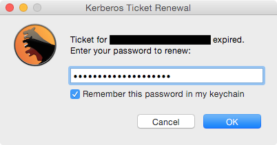

# KerbMinder


**KerbMinder** is a tool for Mac OS X that keeps a logged-in user's Kerberos ticket current by attempting to renew or refresh it automatically any time the network state changes. It only presents a UI if it needs the user to supply a password.



The password can be saved to the keychain so all subsequent renewals can use it. Should the saved password get out of sync with the domain — e.g. after the user changes their password — the keychain will automatically remove the old saved password and the user will be prompted to enter one.

KerbMinder is designed for users with network-authenticated mobile accounts who often work off of corporate networks via VPN.

### Acknowledgements

Portions of KerbMinder were inspired by code written by these fine humans (links point to the inspiring code, where possible):

* [Joe Chilcote](https://github.com/chilcote)
* [Graham Gilbert](http://grahamgilbert.com/blog/2013/07/12/using-crankd-to-react-to-network-events/)
* [Gary Larizza](https://github.com/glarizza/scripts/blob/master/python/RefactoredCrankTools.py)
* [Per Olofsson](https://github.com/MagerValp/Scripted-Mac-Package-Creation/blob/master/scripts/postinstall)

I'd also like to thank

* [Allister Banks](https://twitter.com/Sacrilicious/status/543451138239258624) for pointing out an effective dig command to test for domain reachability.
* [Tim Sutton](http://twitter.com/tvsutton/status/544099669270605824) for telling me about Pashua.

## Requirements

* Mac OS X 10.8.5 or newer (compatible with 10.10.x)
* Python 2.7 (part of OS)
* crankd (PyMacAdmin, included)
* Pashua (included)

## How It Works

KerbMinder logs its activity to the system log. You can open up Console.app and filter for “kerbminder” to see what it’s up to. You may want to make a network change (e.g. toggle off/on your wi-fi interface) to force it to act.

KerbMinder has a few components that operate in tandem.

### crankd.py

Part of the [PyMacAdmin](https://github.com/acdha/pymacadmin) project, crankd is an always-on LaunchDaemon configured to look for network changes. Specifically, it monitors the System Configuration framework's ```State:/Network/Global/IPv4``` subkey, which blips any time an ethernet interface gains or loses an IPv4 address. When a change is detected, it calls the following script.

### CrankTools.py

This script's main purpose is to determine if any ethernet interface (e.g. en0, en1, etc.) has an ip address. When called, it first sleeps for 30 seconds, allowing sufficient time for a wi-fi or VPN connection to be established. Then (with the help of ```networksetup -listnetworkserviceorder```) it gets a list of ethernet interfaces in service priority order and goes down that list looking for the first one with an ip address.

If an interface with an IP address is found, it touches a trigger file (```/Library/Application Support/crankd/kmfiles/trigger```) that the following LaunchAgent watches. This handoff in duties is necessary because this script runs as a LaunchDaemons in the root context, but Kerberos ticket renewals must be done in the user's context.

### KerbMinder.py

This script runs as a triggered LaunchAgent. It refreshes or renews Kerberos tickets based on their discovered status. Before attempting a renewal, it first checks for domain reachability.

If a ticket is refreshable and non-expired, it is refreshed silently. If a ticket is expired or nor present, the script checks if the password has been saved in the keychain. If a keychain entry exists, the saved password is used to retrieve a ticket. If an entry does not exist, the user is prompted for their password (using a secure entry dialog box) and allowed two tries to reduce the chances of account lockout. Two incorrect password attempts results in a warning dialog. If an incorrect attempt results in a locked account, the user is informed that their account is locked.

If the password is correct the ticket is renewed and, if the user has checked the **_Remember this password in my keychain_** option, that password is saved to the keychain so future renewals can occur without user interaction. If the password becomes out of sync with the domain -- e.g. after the domain password has been changed -- then the stored keychain item is purged and the user is prompted for their password.

### Pashua.py and Pashua.app

[Pashua](http://www.bluem.net/en/mac/pashua/) is a tool for creating native Aqua dialog windows. KerbMinder uses it to display a password prompt window with a checkbox to optionally save the password.

## Installation

### The simple way

Download the [KerbMinder release package](https://github.com/pmbuko/KerbMinder/releases/download/v1.0rc2/KerbMinder.v1.0rc2.pkg.zip) and run it. No reboot or logout is necessary, but admin privileges are required.

The KerbMinder.pkgproj bundle in this repo is an installer builder project for the free [Packages](http://s.sudre.free.fr/Software/Packages/about.html) app. If you'd like to build your own .pkg installer, just download the app, double-click on the project file, and then build and run the installer.

### The manual way

First, clone or download & unzip this repo to your computer, and **cd into the repo** from the terminal. (All subsequent paths that do not start with a slash are relative to the root of this repo.) Next, install crankd by running the installer in the pymacadmin directory using root privileges:

```sudo pymacadmin/install-crankd.sh```

Copy files from the repo to their correct locations:

```
sudo cp -R Library/Application\ Support/crankd /Library/Application\ Support/
sudo cp Library/LaunchDaemons/com.googlecode.pymacadmin.crankd.plist /Library/LaunchDaemons/
sudo cp Library/LaunchAgents/org.pmbuko.kerbminder.plist /Library/LaunchAgents/
sudo cp Library/Preferences/com.googlecode.pymacadmin.crankd.plist /Library/Preferences/
```

[Download Pashua.app](http://www.bluem.net/en/mac/pashua/), mount the disk image, copy Pashua.app to the correct location, and remove the inetnet quarantine attribute:

```
sudo cp -Rp /Volumes/Pashua/Pashua.app /Library/Application\ Support/crankd/
sudo xattr -d com.apple.quarantine /Library/Application\ Support/crankd/Pashua.app
```

Set the correct permissions:

```
sudo chown -R root:admin /Library/Application\ Support/crankd
sudo chmod 777 /Library/Application\ Support/crankd/kmfiles
sudo chmod 755 /Library/Application\ Support/crankd/*.py
sudo chown -R root:wheel /Library/LaunchDaemons/com.googlecode.pymacadmin.crankd.plist
sudo chmod 644 /Library/LaunchDaemons/com.googlecode.pymacadmin.crankd.plist
sudo chown -R root:wheel /Library/LaunchAgents/org.pmbuko.kerbminder.plist
sudo chmod 644 /Library/LaunchAgents/org.pmbuko.kerbminder.plist
sudo chown -R root:wheel /Library/Preferences/com.googlecode.pymacadmin.crankd.plist
sudo chmod 644 /Library/Preferences/com.googlecode.pymacadmin.crankd.plist
```


Finally, start the LaunchDaemon and LaunchAgent. (Note the lack of sudo on the second command):

```
sudo launchctl load /Library/LaunchDaemons/com.googlecode.pymacadmin.crankd.plist
launchctl load /Library/LaunchAgents/org.pmbuko.kerbminder.plist
```

## ADPassMon Integration

The latest release of my [ADPassMon](http://yourmacguy.wordpress.com/ADPassMon) software lets users enable/disable KerbMinder via a menu item.
